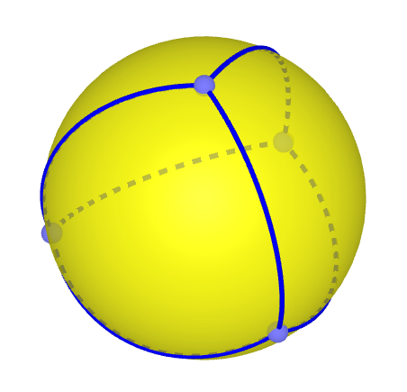

# Sixty Nautical Miles per Degree on Flat Earth

## Content

- [Introduction](#introduction)
	- [GP and Zenith](#gp-and-zenith)
	- [60 NM per Degree](#60-nm-per-degree)
	- [Trigonometry Issue on Flat Earth](#trigonometry-issue-on-flat-earth)
	- [Four Points](#four-points)

## Introduction

### GP and Zenith

The position on earth where a star appears overhead is called the geographical position (GP) of that star. Another key concept here is the name of this point directly overhead, it is called **Zenith**.

### 60 NM per Degree

It is a rule of thumb that a distance between an observer and the GP of a star correlates to how high in the sky the star observed from that observer, and that correlation is understood to be 60 nautical miles (NM) per degree.

For example, let's say the star Betelgeuse is directly overhead (at the zenith of) an observer, that means that observer is standing on Betelgeuse's GP. At the same time a second observer observers Betelgeuse but for him the star is 30° below his zenith. Using the rule of thumb the distance between those observers would be $60 \times 30 = 1800$ NM. If another observer has the star 60° below his zenith, than this third observer would be $60 \times 60 = 3600$ NM away from the star's GP and so on.

### Trigonometry Issue on Flat Earth

If you're familiar with trigonometry you might already be spotting an issue for flat earth with this correlation. We can use trigonometric functions to figure out for example how high the top of a building will appear for an observer giving the building's height, the observer's height and the distance between the observer and the building. And for the top of the building to drop from 30° to 60° by simply backing away from it over a flat surface would require you to triple your distance to the building, while with the rule of thumb of navigation the distance is just doubling.

There are, however, ad-hoc hypotheses that could explain how this 60 NM per degree relationship could emerge on flat earth, with some type of upward light bending or some other sort of idea. The goal of this document is not to explore this argument, we will simply accept the rule and assume there is some mechanism that explains it or causes it on flat earth and move forward.

### Four Points

There is still a deeper problem to be explored, because this relationship can provide us with long distances between points on Earth's surface, and again with the help of geometry or with scaled down models, we can determine whether this distances could or could not exist within a plane.

If it's not clear that with distances between points it's possible to rule out they being on a plane, try picturing four points on the same plane that have the same distance between all pairs of points. If you immediately thought of a square, notice that the four pairs of adjacent points forming the sides of the squares are equidistant, opposing points that form diagonals in this square are further, around 41.4% larger to be specific. There are six pairs of points in a group of four points. And it's not possible to have all pairs equidistant when the points are in the same plane.

If you're now wondering if a curved surface could solve that, it turns out it can. You can play with a 3D example of it [here](https://www.geogebra.org/m/m6A6U95q). Or just check the Image below.

<!-- 
- name: Tres Marias - Mexico
- GP: N 19° 3' 7.40", W 99° 14' 33.50"
- time: 2024-04-03 08:05:10
- star: Arcturus

- name: Saint-Constant - Canada
- GP: N 45° 22' 1.40", W 73° 34' 55.50"
- time: 2024-07-22 05:34:45
- star: Deneb

- name: Jaboatão dos Guararapes - Brazil
- GP: S 8° 10' 20.70", W 34° 54' 54.40"
- time: 2024-12-21 01:34:56
- star: Rigel

- name: Cuiabá - Brazil
- GP: S 15° 36' 35.70", W 56° 3' 58.40"

- Saint-Constant to Tres Marias: 56° 12' 00.0"
- Cuiabá to Tres Marias:         35° 11' 46.4"
- Jaboatão to Saint-Constant:    26° 15' 14.1"
- Cuiabá to Saint-Constant:      27° 01' 09.9"
- Cuiabá to Jaboatão:            68° 02' 02.6"
- Tres Marias to Jaboatão:       21° 04' 38.9"
-->