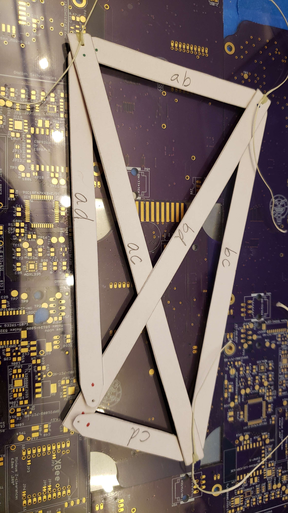
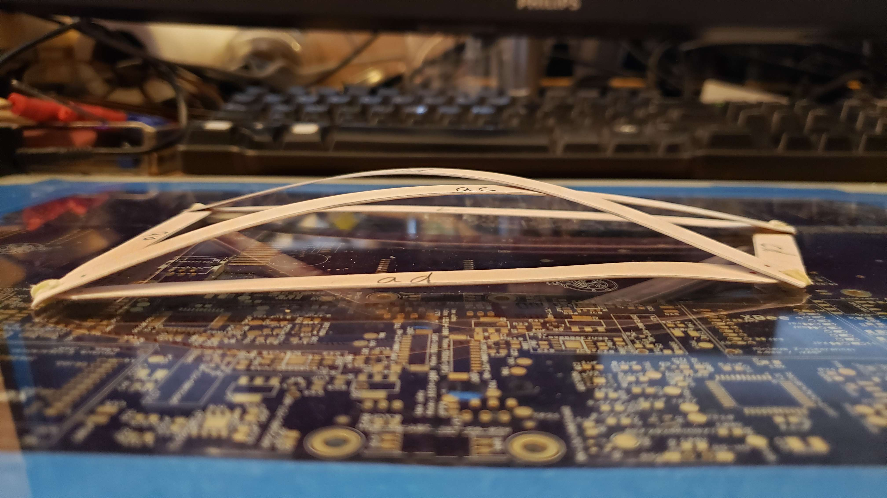
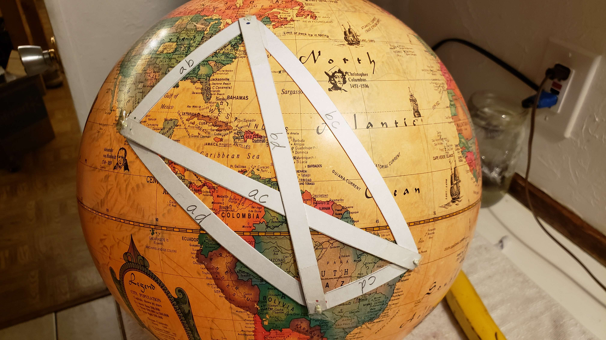
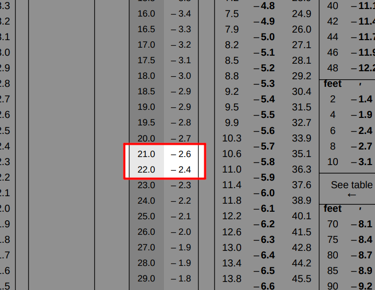

# 60 Nautical Miles per Degree on Flat Earth

## Content

- [Introduction](#introduction)
	- [GP and zenith](#gp-and-zenith)
	- [60 nm per degree](#60-nm-per-degree)
	- [The trigonometry problem on flat Earth](#the-trigonometry-problem-on-flat-earth)
	- [The geometry of four points](#the-geometry-of-four-points)
- [The Data](#the-data)
	- [Testing it with flat Earth](#testing-it-with-flat-earth)
	- [Testing it with globe Earth](#testing-it-with-globe-earth)
	- [What about refraction?](#what-about-refraction)

## Introduction

In this document we'll look at how a simple rule used in celestial navigation debunks the idea that Earth could be flat.

### GP and Zenith

The position on Earth where a star appears overhead is called the geographical position (GP) of that star. Another key concept here is the name of this point directly overhead, it is called **Zenith**.

### 60 NM per Degree

It is a rule of thumb that the distance between an observer and the GP of a star correlates to how high in the sky the star is for that observer, and that correlation is understood to be 60 nautical miles (NM) per degree.

For example, let's say the star Betelgeuse is directly overhead (at the zenith of) an observer, that means that observer is standing on Betelgeuse's GP. At the same time a second observer sights Betelgeuse, but for him the star is 30° below his zenith. Using the rule of thumb the distance between these two observers would be $60 \times 30 = 1800$ NM. If another observer has the star 60° below his zenith, then this third observer would be $60 \times 60 = 3600$ NM away from the star's GP and so on.

### The Trigonometry Problem on Flat Earth

If you're familiar with trigonometry you might already be spotting an issue for flat Earth with this correlation. We can use trigonometric functions to figure out, for example, how high the top of a building will appear for an observer giving the building's height, the observer's height and the distance between the observer and the building. And for the top of the building to drop from 30° to 60° by simply moving away from it over a flat surface it would require you to triple your distance to the building, while with the rule of thumb of navigation the distance is just doubling.

There are, however, ad-hoc hypotheses that could explain how this 60 NM per degree relationship could emerge on flat Earth, with some type of upward light bending or some other sort of idea. The goal of this document is not to explore this argument, we will simply accept the rule and assume there is some mechanism that explains it or causes it on flat Earth and move forward.

### The Geometry of Four Points

There is still a deeper problem to be explored, because this relationship can provide us with long distances between points on Earth's surface, and again, with the help of geometry or with scaled down models, we can determine whether these distances could or could not exist within a flat surface.

If it's not clear that with distances between points it's possible to rule out they being on a plane, try picturing four points on the same plane that have the same distance between all pairs of points. If you immediately thought of a square, notice that the four pairs of adjacent points forming the sides of the square are equidistant, however opposing points that form diagonals in this square are at a larger distance apart, around 41.4% larger.

There are six pairs of points in a group of four points. And it's not possible to have all six pairs equidistant when the points are in the same plane.

If you're now wondering if a curved surface could solve that, it turns out it can. You can play with a 3D example of it [here](https://www.geogebra.org/m/m6A6U95q). Or just check the Image below.

## The Data

Four cities were picked for this experiment: Tres Marias (Mexico), Saint-Constant (Canada), Jaboatão dos Guararapes (Brazil) and Cuiabá (Brazil). Three of them are in the path of the GP of a navigation star. So for around half the year those cities every night at some point become the GP of their respective stars, allowing other observers to get their distance to it by simply measuring the angle to that star. The fourth city, Cuiabá, isn't in the path of a navigation star, but from that city the other stars can be observed when their GPs are over the target cities.

Here are the coordinates considered for each city:
- **Tres Marias:** N 19° 3' 7.40", W 99° 14' 33.50"
- **Saint-Constant:** N 45° 22' 1.40", W 73° 34' 55.50"
- **Jaboatão:** S 8° 10' 20.70", W 34° 54' 54.40"
- **Cuiabá:** S 15° 36' 35.70", W 56° 3' 58.40"

Taking the actual measurements would require some effort and resources, either finding volunteers that have access to the given locations or paying professionals to do it. Still doable. But so far I'll resort to a free and open source software that can render how the sky is observed from any given location and time with high accuracy, which is [Stellarium](https://stellarium.org/).

Setting the time for UTC 8:05:10 AM, April 3rd, 2024, we get that the Star Arcturus is overhead Tres Marias. At that same time, Arcturus is observed to be at the altitude angles `56° 12' 00.0"` from Saint-Constant and `35° 11' 46.4"` from Cuiabá.

At UTC 5:34:45 AM, July 22nd, 2024, the star Deneb is over Saint-Constant, and its altitude angles are `26° 15' 14.1"` from Jaboatão and `27° 01' 09.9"` from Cuiabá.

At UTC 1:34:56 AM, December 21st, 2024, the star Rigel is over Jaboatão, and its altitude angles are `68° 02' 02.6"` from Cuiabá and `21° 04' 38.9"` from Tres Marias.

Stellarium Screenshots:
- [Arcturus over Tres Marias](img/01-arcturus-over-tres-marias.png)
- [Arcturus sighted from Saint-Constant](img/02-saint-constant-to-tres-marias.png)
- [Arcturus sighted from Cuiabá](img/03-cuiaba-to-tres-marias.png)
- [Deneb over Saint-Constant](img/04-deneb-over-saint-constant.png)
- [Deneb sighted from Jaboatão](img/05-jaboatao-to-saint-constant.png)
- [Deneb sighted from Cuiabá](img/06-cuiaba-to-saint-constant.png)
- [Rigel over Jaboatão](img/07-rigel-over-jaboatao.png)
- [Rigel sighted from Cuiabá](img/08-cuiaba-to-jaboatao.png)
- [Rigel sighted from Tres Marias](img/09-tres-marias-to-jaboatao.png)

All those angles are altitude angles, they are the compliment of the angle from zenith. What that means is that when the star is at zenith, the altitude angle will be 90°, just like when the angle from zenith is 90° the altitude angle will be 0°. We can switch between them by subtracting the angle from 90°. Using the celestial navigation rule we then multiply the resulting angles by 60 NM and that should gives us the distances between all of these cities at the points we used for the observations.

| From           | To             | Alt.          | Zenith     | Distance   |
|----------------|----------------|---------------|------------|------------|
| Saint-Constant | Tres Marias    | 56° 12' 00.0" | 33.800000° | 2028.00 NM |
| Cuiabá         | Tres Marias    | 35° 11' 46.4" | 54.803778° | 3288.23 NM |
| Jaboatão       | Saint-Constant | 26° 15' 14.1" | 63.746083° | 3824.76 NM |
| Cuiabá         | Saint-Constant | 27° 01' 09.9" | 62.980583° | 3778.84 NM |
| Cuiabá         | Jaboatão       | 68° 02' 02.6" | 21.965944° | 1317.96 NM |
| Tres Marias    | Jaboatão       | 21° 04' 38.9" | 68.922528° | 4135.35 NM |

## Testing It With Flat Earth

One way we can test whether these distances can fit a plane or a sphere is to scale them down and try to connect four points with physical representation of distances. Which is what [Jesse Gordon](https://www.youtube.com/@fromjesse) did with these values. He cut stripes of paper with two small holes, one on each end, where the distance between the holes were scaled down versions of the nautical mile distances we got. The scale used was 1 to 41.5 millions. He then tied the holes using strings.

After tying three holes, it's already possible to notice that the remaining distances can't simultaneously match a consistent remaining point, at least not when those distances are lying on a flat surface.

And after tying the last holes, the diagonals of the quadrilateral formed bend out of the surface.

The diagonal distances are too great to fit inside of the four points.

## Testing It With Globe Earth

The choice of the scale wasn't arbitrary, Jesse also has a globe with 38 inches of circumference, which is 41.5 million times smaller than the circumference of the globe model, so these stripes should match his globe. And this is what he got:

## What About Refraction?

It's understood that the 60 NM per degree relationship is less accurate for lower elevation angles, navigators tend to apply a correction for lower angles to account for the effects of the atmosphere in the apparent position of celestial bodies. One could argue that this excess in distance that showed up when trying to lay the distances flat were due to refraction not being accounted for. So let's do it!

In nautical almanacs like the one you can find on this [link](https://thenauticalalmanac.com/TNARegular/2024_Nautical_Almanac.pdf) there are pages for altitude corrections, one of which is the refraction correction, where in the first column you have the altitude angle you want to correct, and the second column the correction you have to add.

In the case of our lowest angle of `21° 04' 38.9"` the correction would be more than `-2.6'`, which would translate to our scaled model to one of the stripes being `0.005 in` smaller. That would be the **largest** correction, because every other angle is higher, so the correction would be smaller. A correction so miniscule it would be hard to even notice whether or not it was applied. So no, applying or not refraction corrections does not significantly change the results.
